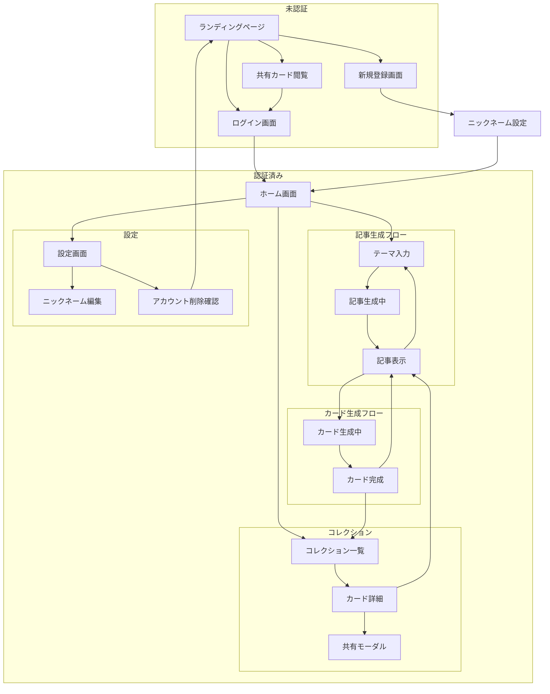
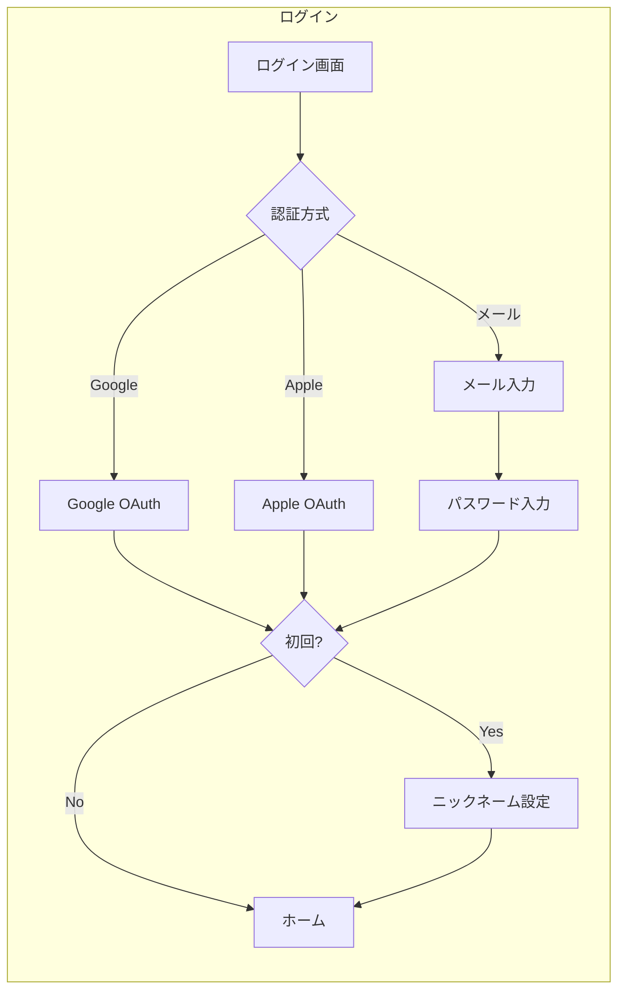
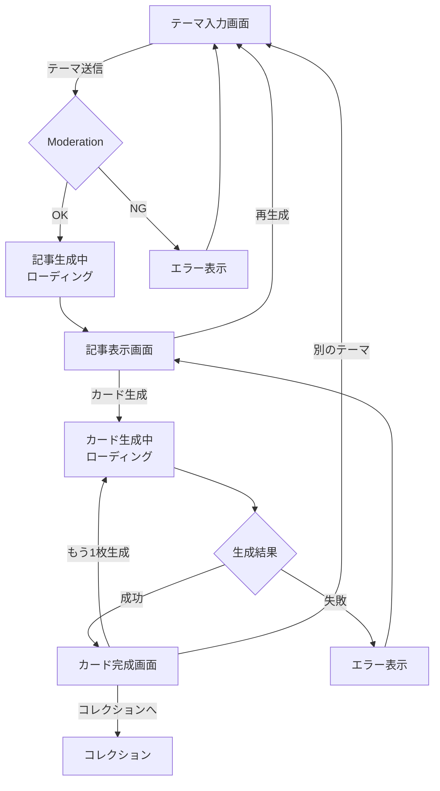
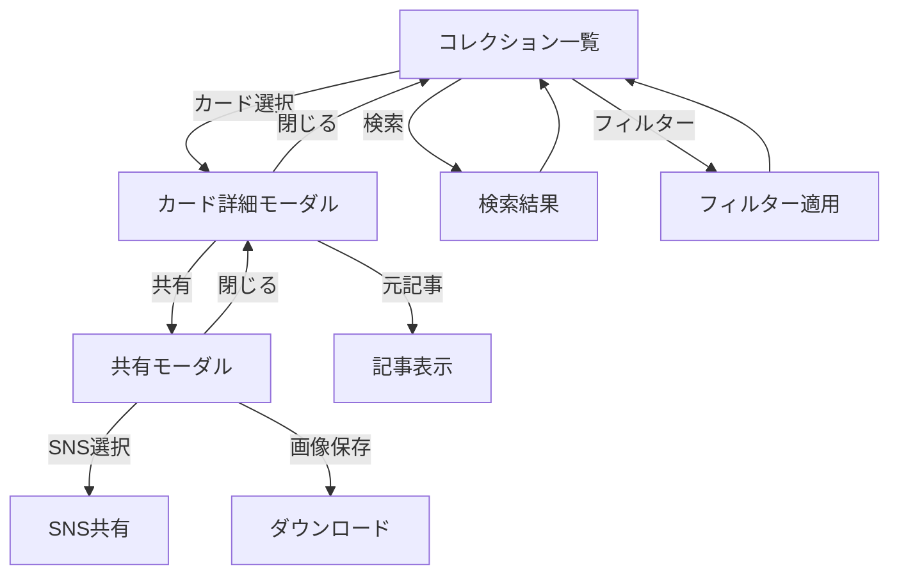

# 08. 画面遷移図

## 8.1 全体画面遷移図



## 8.2 画面一覧

| 画面ID | 画面名 | パス | 認証 |
|--------|--------|------|------|
| LP | ランディングページ | / | 不要 |
| Login | ログイン | /login | 不要 |
| Register | 新規登録 | /register | 不要 |
| NicknameSetup | ニックネーム設定 | /setup | 必要 |
| Home | ホーム | /home | 必要 |
| ThemeInput | テーマ入力 | /create | 必要 |
| ArticleView | 記事表示 | /articles/:id | 必要 |
| CardResult | カード完成 | /cards/:id/new | 必要 |
| Collection | コレクション | /collection | 必要 |
| CardDetail | カード詳細 | /cards/:id | 必要 |
| Settings | 設定 | /settings | 必要 |
| SharedCard | 共有カード | /share/:id | 不要 |

## 8.3 詳細画面遷移

### 8.3.1 認証フロー



### 8.3.2 記事・カード生成フロー



### 8.3.3 コレクション画面フロー



## 8.4 画面詳細

### 8.4.1 ランディングページ (/)

```
┌─────────────────────────────────────────────────────────┐
│  [ロゴ]                              [ログイン] [登録]  │
├─────────────────────────────────────────────────────────┤
│                                                         │
│              学習カードジェネレーター                    │
│                                                         │
│         AIで学習記事を生成し、                          │
│         世界に1枚だけのカードを手に入れよう             │
│                                                         │
│              [今すぐ始める]                             │
│                                                         │
├─────────────────────────────────────────────────────────┤
│                                                         │
│  ┌─────────┐  ┌─────────┐  ┌─────────┐               │
│  │ 特徴1   │  │ 特徴2   │  │ 特徴3   │               │
│  │ AI記事  │  │ ユニーク│  │ コレクト │               │
│  └─────────┘  └─────────┘  └─────────┘               │
│                                                         │
├─────────────────────────────────────────────────────────┤
│                                                         │
│  カードサンプルギャラリー                               │
│  [カード1] [カード2] [カード3] [カード4]               │
│                                                         │
└─────────────────────────────────────────────────────────┘
```

### 8.4.2 ホーム画面 (/home)

```
┌─────────────────────────────────────────────────────────┐
│  [ロゴ]                    [コレクション] [設定] [👤]   │
├─────────────────────────────────────────────────────────┤
│                                                         │
│  こんにちは、{nickname}さん                             │
│                                                         │
│  ┌─────────────────────────────────────────────────┐   │
│  │                                                 │   │
│  │        新しいカードを作る                       │   │
│  │                                                 │   │
│  │   テーマを入力して、AIが学習記事を生成          │   │
│  │   記事からあなただけのカードが生まれます         │   │
│  │                                                 │   │
│  │              [記事を生成する →]                 │   │
│  │                                                 │   │
│  └─────────────────────────────────────────────────┘   │
│                                                         │
│  最近のカード                                           │
│  ┌────┐  ┌────┐  ┌────┐  ┌────┐                      │
│  │    │  │    │  │    │  │    │                      │
│  └────┘  └────┘  └────┘  └────┘                      │
│                                                         │
│  コレクション統計                                       │
│  総カード: 156枚  レジェンド: 2枚                       │
│                                                         │
└─────────────────────────────────────────────────────────┘
```

### 8.4.3 テーマ入力画面 (/create)

```
┌─────────────────────────────────────────────────────────┐
│  [← 戻る]                           記事を生成          │
├─────────────────────────────────────────────────────────┤
│                                                         │
│                                                         │
│              学びたいテーマを入力                       │
│                                                         │
│  ┌─────────────────────────────────────────────────┐   │
│  │                                                 │   │
│  │  学びたいテーマを入力...                        │   │
│  │                                                 │   │
│  └─────────────────────────────────────────────────┘   │
│                                            0 / 30文字   │
│                                                         │
│  💡 例: 「万有引力の発見」「恐竜の絶滅」               │
│                                                         │
│              [記事を生成する]                           │
│              (入力後に活性化)                           │
│                                                         │
│                                                         │
│  最近生成したテーマ:                                    │
│  • 光合成のしくみ                                       │
│  • ピラミッドの建設                                     │
│  • 宇宙の始まり                                         │
│                                                         │
└─────────────────────────────────────────────────────────┘
```

### 8.4.4 記事表示画面 (/articles/:id)

```
┌─────────────────────────────────────────────────────────┐
│  [← 戻る]                           万有引力の発見      │
├─────────────────────────────────────────────────────────┤
│                                                         │
│  テーマ: 万有引力の発見                                 │
│  ─────────────────────────────────────────────────────  │
│                                                         │
│  17世紀、イギリスの科学者アイザック・ニュートンは、     │
│  りんごが木から落ちるのを見て、ある疑問を抱きました。   │
│  「なぜ物は下に落ちるのだろうか？」                     │
│                                                         │
│  ...（記事本文800文字）...                              │
│                                                         │
│  ─────────────────────────────────────────────────────  │
│                                                         │
│  ┌───────────────────┐  ┌───────────────────┐         │
│  │                   │  │                   │         │
│  │  🎴 カードを生成   │  │  🔄 別のテーマで  │         │
│  │                   │  │     再生成        │         │
│  └───────────────────┘  └───────────────────┘         │
│                                                         │
└─────────────────────────────────────────────────────────┘
```

### 8.4.5 カード完成画面 (/cards/:id/new)

```
┌─────────────────────────────────────────────────────────┐
│                                                         │
│                    ✨ 新しいカード ✨                    │
│                                                         │
│              ┌─────────────────────┐                   │
│              │                     │                   │
│              │                     │                   │
│              │     [カード画像]     │                   │
│              │                     │                   │
│              │                     │                   │
│              │  りんご             │                   │
│              │  ★★★☆☆ レア        │                   │
│              │                     │                   │
│              │  「落下する瞬間、   │                   │
│              │   宇宙の法則が      │                   │
│              │   姿を現した」      │                   │
│              │                     │                   │
│              │      2025.01.22     │                   │
│              └─────────────────────┘                   │
│                                                         │
│  ┌─────────┐  ┌─────────┐  ┌─────────┐               │
│  │コレクション│  │ 共有    │  │もう1枚  │               │
│  │  へ      │  │         │  │ 生成    │               │
│  └─────────┘  └─────────┘  └─────────┘               │
│                                                         │
└─────────────────────────────────────────────────────────┘
```

## 8.5 モーダル・オーバーレイ

### 8.5.1 ローディング（記事生成中）

```
┌─────────────────────────────────────────────────────────┐
│                                                         │
│                                                         │
│                       ⏳                                │
│                                                         │
│                  記事を生成中...                        │
│                                                         │
│              テーマ: 万有引力の発見                     │
│                                                         │
│                                                         │
└─────────────────────────────────────────────────────────┘
```

### 8.5.2 ローディング（カード生成中）

```
┌─────────────────────────────────────────────────────────┐
│                                                         │
│                       🎴                                │
│                                                         │
│                カードを生成中...                        │
│                                                         │
│              ┌──────────────────┐                      │
│              │ キーワード抽出中  │ ✓                   │
│              │ レア度判定中     │ ✓                   │
│              │ イラスト生成中   │ ⏳                   │
│              │ カード合成中     │ ○                   │
│              └──────────────────┘                      │
│                                                         │
└─────────────────────────────────────────────────────────┘
```

### 8.5.3 共有モーダル

```
┌─────────────────────────────────────────────────────────┐
│  カードを共有                                    [✕]   │
├─────────────────────────────────────────────────────────┤
│                                                         │
│  ┌─────────────────────────────────────────────────┐   │
│  │  🐦 X (Twitter) で共有                          │   │
│  └─────────────────────────────────────────────────┘   │
│                                                         │
│  ┌─────────────────────────────────────────────────┐   │
│  │  💬 LINE で共有                                 │   │
│  └─────────────────────────────────────────────────┘   │
│                                                         │
│  ┌─────────────────────────────────────────────────┐   │
│  │  📥 画像を保存                                  │   │
│  └─────────────────────────────────────────────────┘   │
│                                                         │
│  ┌─────────────────────────────────────────────────┐   │
│  │  🔗 リンクをコピー                              │   │
│  └─────────────────────────────────────────────────┘   │
│                                                         │
└─────────────────────────────────────────────────────────┘
```

## 8.6 レスポンシブ対応

### ブレークポイント

| サイズ | 幅 | 対象 |
|--------|-----|------|
| sm | < 640px | スマートフォン |
| md | 640px - 1024px | タブレット |
| lg | > 1024px | デスクトップ |

### コレクション画面のグリッド

| サイズ | カード/行 |
|--------|----------|
| sm | 2 |
| md | 3 |
| lg | 4 |
